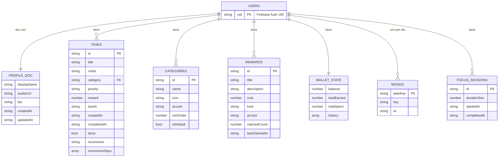
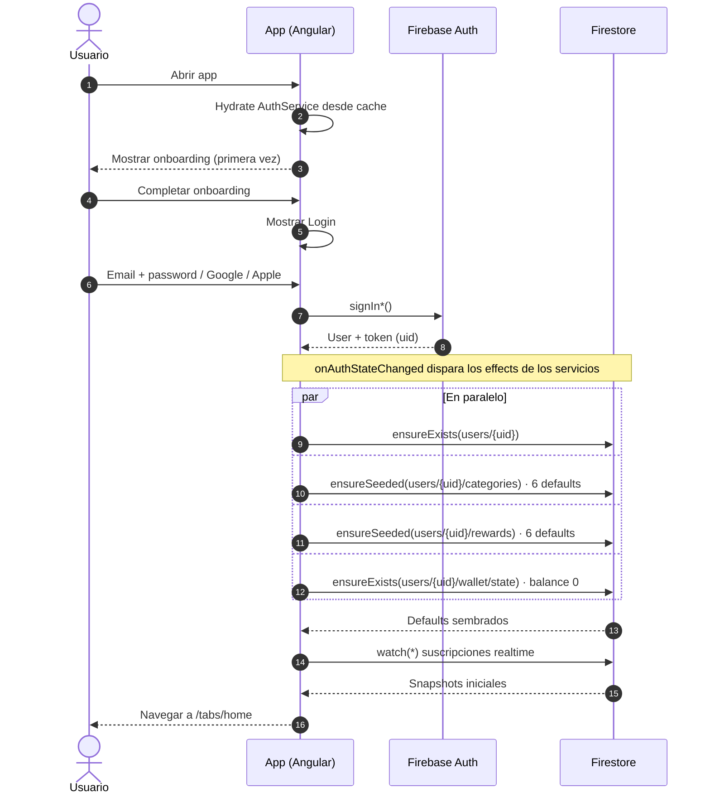
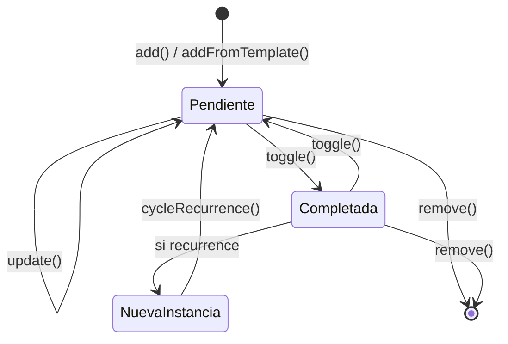
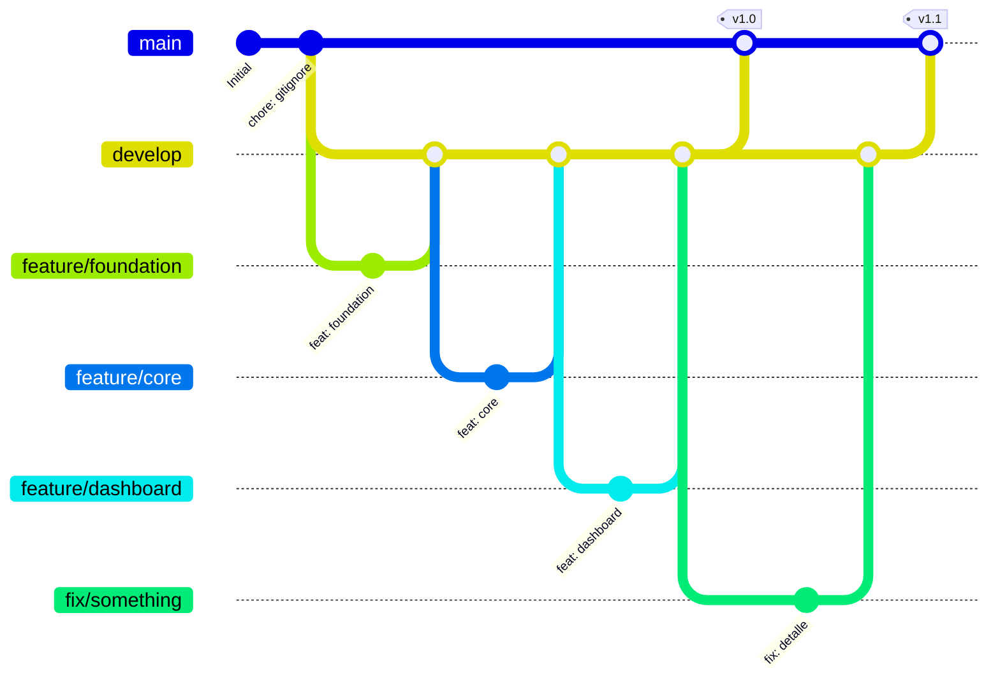

<div align="center">

# TODO BELT

**Productividad amable. Enfoque, recompensas y disciplina sin estrés.**

Aplicación móvil-web de productividad construida con Ionic 8 y Angular 19,
con backend completo en Firebase (Auth, Firestore, Remote Config) y
notificaciones nativas vía Capacitor.

[](#9-historial-de-releases)
[](https://ionicframework.com)
[](https://angular.dev)
[](https://firebase.google.com)
[](https://capacitorjs.com)

</div>

---

## Tabla de contenidos

1. [Acerca de TODO BELT](#1-acerca-de-todo-belt)
2. [Stack tecnológico](#2-stack-tecnológico)
3. [Arquitectura](#3-arquitectura)
   - [Vista general por capas](#vista-general-por-capas)
   - [Modelo de datos en Firestore](#modelo-de-datos-en-firestore)
   - [Flujo de autenticación y siembra inicial](#flujo-de-autenticación-y-siembra-inicial)
4. [Funcionalidades principales](#4-funcionalidades-principales)
   - [4.1 Gestión de tareas](#41-gestión-de-tareas)
   - [4.2 Categorías personalizables](#42-categorías-personalizables)
   - [4.3 Economía de monedas](#43-economía-de-monedas)
   - [4.4 Catálogo de recompensas](#44-catálogo-de-recompensas)
   - [4.5 Modo Enfoque (Pomodoro)](#45-modo-enfoque-pomodoro)
   - [4.6 Estado de ánimo diario](#46-estado-de-ánimo-diario)
   - [4.7 Estadísticas](#47-estadísticas)
   - [4.8 Notificaciones del sistema](#48-notificaciones-del-sistema)
5. [Feature flags](#5-feature-flags)
6. [Cómo ejecutar la aplicación](#6-cómo-ejecutar-la-aplicación)
   - [6.1 Requisitos previos](#61-requisitos-previos)
   - [6.2 Clonar e instalar dependencias](#62-clonar-e-instalar-dependencias)
   - [6.3 Configuración de Firebase](#63-configuración-de-firebase)
   - [6.4 Reglas de Firestore](#64-reglas-de-firestore)
   - [6.5 Habilitar Remote Config](#65-habilitar-remote-config)
   - [6.6 Ejecutar en modo desarrollo](#66-ejecutar-en-modo-desarrollo)
   - [6.7 Compilar para producción (web)](#67-compilar-para-producción-web)
   - [6.8 Compilar para Android](#68-compilar-para-android)
   - [6.9 Compilar para iOS](#69-compilar-para-ios)
   - [6.10 Solución de problemas comunes](#610-solución-de-problemas-comunes)
7. [Estructura del proyecto](#7-estructura-del-proyecto)
8. [Reglas de Firestore (copia lista)](#8-reglas-de-firestore-copia-lista)
9. [Historial de releases](#9-historial-de-releases)
10. [Flujo de Git](#10-flujo-de-git)
11. [Decisiones de diseño](#11-decisiones-de-diseño)
12. [Respondiendo preguntas](#12-respondiendo-preguntas)
    - [12.1 Principales desafíos](#121-cuáles-fueron-los-principales-desafíos-al-implementar-las-nuevas-funcionalidades)
    - [12.2 Técnicas de optimización](#122-qué-técnicas-de-optimización-de-rendimiento-aplicaste-y-por-qué)
    - [12.3 Calidad y mantenibilidad](#123-cómo-aseguraste-la-calidad-y-mantenibilidad-del-código)

---

## 1. Acerca de TODO BELT

TODO BELT **no es un simple gestor de tareas**. Es una herramienta de
productividad amable diseñada alrededor de tres principios:

1. **Disciplina sin estrés.** Las reglas para ganar monedas no premian
   marcar tareas a lo loco — requieren tiempo real y constancia. Pero
   tampoco penalizan duramente: si llegas tarde, ganas la mitad; si
   completas la tarea sin reloj, sigues ganando lo justo.
2. **Recompensas concretas.** Las monedas se cambian por cosas reales
   que el usuario disfruta (un café, un helado, una pausa, una caminata).
   No son XP virtual ni medallas; son permisos para cuidarse.
3. **Calma visual.** Estética premium dark-first inspirada en Linear,
   Notion y Things 3. Cero gamificación infantil, cero saturación, cero
   colores chillones. El rosa vibrante (`#FF4FA3`) es el único color de
   marca; los acentos azul / verde / amarillo / morado se usan **sólo
   como detalles** en iconos de categoría.

### ¿A quién está dirigida?

Personas que sienten que las apps de productividad tradicionales son
frías, demandantes o gamificadas en exceso. TODO BELT busca el punto
medio entre la disciplina y la auto-compasión: te ayuda a avanzar sin
juzgarte cuando un día no rindes.

### Identidad de marca

| Elemento | Valor |
|---|---|
| Logo conceptual | Cinturón rosa minimalista (campana en versiones tempranas del onboarding) |
| Color primario | `#FF4FA3` rosa vibrante elegante |
| Fondos | `#050505`, `#111111`, `#181818` negro profundo escalonado |
| Tipografía | Inter (system stack) |
| Tono de voz | Calmado, motivador, en segunda persona |

---

## 2. Stack tecnológico

| Capa | Tecnología | Versión | Rol |
|---|---|---|---|
| Framework UI | [Ionic](https://ionicframework.com) | 8 | Componentes nativos, gestos, navegación |
| Framework JS | [Angular](https://angular.dev) | 19 | Standalone components, signals, routing |
| Lenguaje | TypeScript | 5.6 | Tipado estricto |
| Backend | [Firebase](https://firebase.google.com) | 12 | Auth, Firestore, Remote Config |
| Empaquetador móvil | [Capacitor](https://capacitorjs.com) | 6 | Build Android / iOS |
| Plugin notificaciones | `@capacitor/local-notifications` | 8 | Recordatorios locales nativos |
| Estilos | SCSS (módulos `@use`) | — | Tokens de diseño centralizados |
| Animación slider | [Swiper](https://swiperjs.com) | 11 | Onboarding multi-slide |

Características técnicas destacadas:

- **Componentes standalone** (sin NgModules) en todo el árbol.
- **Angular Signals** como mecanismo único de reactividad. Cada servicio
  expone su estado como `computed()` signals; las páginas se suscriben
  declarativamente.
- **Modular Firebase SDK** (`firebase/auth`, `firebase/firestore`,
  `firebase/remote-config`) para minimizar el bundle.
- **Path aliases** (`@core/*`, `@shared/*`, `@pages/*`, `@env/*`) para
  imports limpios.

---

## 3. Arquitectura

### Vista general por capas

```mermaid
flowchart TB
    subgraph UI ["Capa de presentación"]
        PAGES["Pages<br/>Home · Tasks · Focus<br/>Rewards · Profile · Stats<br/>Categories · Onboarding · Login"]
        SHARED["Shared components<br/>BellLogo · CoinBadge · TaskCard<br/>RewardCard · MoodSelector · PrimaryButton"]
    end

    subgraph DOMAIN ["Capa de dominio (signal-based)"]
        AUTH[AuthService]
        TASKS[TasksService]
        CATS[CategoriesService]
        WALLET[WalletService]
        REWARDS[RewardsService]
        FOCUS[FocusService]
        MOOD[MoodService]
        STATS[StatsService]
        PROFILE[ProfileService]
        NOTIF[NotificationService]
        FLAGS[FeatureFlagsService]
    end

    subgraph PERSIST ["Capa de persistencia"]
        FS_TASKS[FirestoreTasksService]
        FS_CATS[FirestoreCategoriesService]
        FS_WALLET[FirestoreWalletService]
        FS_REWARDS[FirestoreRewardsService]
        FS_PROFILE[FirestoreProfileService]
        FS_FOCUS[FirestoreFocusService]
        FS_MOOD[FirestoreMoodService]
        STORAGE[StorageService<br/>Preferences + localStorage]
    end

    subgraph FIREBASE ["Firebase / OS"]
        AUTHFB[(Firebase Auth)]
        FIRESTORE[(Firestore)]
        RC[(Remote Config)]
        CAP[Capacitor<br/>Local Notifications]
    end

    PAGES --> SHARED
    PAGES --> AUTH
    PAGES --> TASKS
    PAGES --> CATS
    PAGES --> WALLET
    PAGES --> REWARDS
    PAGES --> FOCUS
    PAGES --> MOOD
    PAGES --> STATS
    PAGES --> PROFILE
    PAGES --> FLAGS

    AUTH --> AUTHFB
    TASKS --> FS_TASKS
    TASKS --> NOTIF
    CATS --> FS_CATS
    WALLET --> FS_WALLET
    REWARDS --> FS_REWARDS
    PROFILE --> FS_PROFILE
    FOCUS --> FS_FOCUS
    MOOD --> FS_MOOD
    STATS --> FS_FOCUS
    STATS --> FS_MOOD
    FLAGS --> RC
    AUTH --> STORAGE

    FS_TASKS --> FIRESTORE
    FS_CATS --> FIRESTORE
    FS_WALLET --> FIRESTORE
    FS_REWARDS --> FIRESTORE
    FS_PROFILE --> FIRESTORE
    FS_FOCUS --> FIRESTORE
    FS_MOOD --> FIRESTORE

    NOTIF --> CAP
```



**Por qué tres capas separadas:**

- La **presentación** sólo consume signals. No conoce Firebase.
- La **capa de dominio** orquesta reglas de negocio (cálculo de monedas,
  anti-cheat, recurrencia) y mantiene el estado local con signals.
- La **capa de persistencia** (`firestore-*.service.ts`) aísla todos los
  detalles de Firestore. Cambiar de backend mañana significa reescribir
  esa capa sin tocar UI ni dominio.

### Modelo de datos en Firestore

Cada usuario tiene un árbol completo bajo `users/{uid}`. **Ningún
usuario puede leer datos de otros** (ver
[Reglas de Firestore](#8-reglas-de-firestore-copia-lista)).



### Flujo de autenticación y siembra inicial

Al primer login, la app siembra automáticamente las colecciones por
defecto del usuario para que la UI tenga datos coherentes desde el
momento cero.



---

## 4. Funcionalidades principales

### 4.1 Gestión de tareas

CRUD completo persistido en Firestore con sincronización en tiempo real
entre dispositivos del mismo usuario.

**Capacidades:**

- **Crear** tareas con título, categoría, prioridad (low/medium/high),
  hora opcional del día y recurrencia opcional.
- **Editar** desde el menú de acciones — reabre el sheet en modo edición.
- **Eliminar** con alerta de confirmación.
- **Marcar completa** desde el círculo del check (acción rápida) o
  desde el menú "Marcar como completada".
- **14 plantillas pre-cargadas** dentro del modal de creación: vasos de
  agua a 09/12/15/18, revisar correos, ejercicio 2h, caminar 30min,
  estirar, meditar, leer, estudiar 1h, ordenar espacio, proyecto
  creativo.
- **Recurrencia diaria o semanal** con selector de días de la semana
  (L M X J V S D) y presets L-V / Fines de semana / Todos los días.
- **Cajón de completadas** colapsable al final de la página para que
  las tareas hechas no contaminen la lista activa.

**Ciclo de vida:**



### 4.2 Categorías personalizables

Cada usuario tiene su propio catálogo de categorías, sembrado con 6
defaults en el primer login.

| ID | Nombre | Icono | Color | Protegida |
|---|---|---|---|---|
| `work` | Trabajo | briefcase-outline | Azul | Sí |
| `personal` | Personal | sparkles-outline | Rosa | Sí |
| `health` | Salud | heart-outline | Verde | Sí |
| `study` | Estudio | book-outline | Morado | Sí |
| `home` | Hogar | home-outline | Amarillo | Sí |
| `creative` | Creativo | color-palette-outline | Rosa suave | Sí |

**Operaciones disponibles** (ruta `/tabs/categories`, accesible desde
el icono de etiquetas en la página de tareas):

- **Crear** categorías personalizadas: nombre, 16 iconos curados, 5
  colores oficiales de la marca, preview en vivo.
- **Editar** cualquiera, incluso las defaults (sólo se editan, no se
  borran).
- **Eliminar** las propias. Las **6 defaults están protegidas tanto en
  cliente como en Firestore Rules**, y cualquier categoría con tareas
  asignadas se rechaza con un toast explicativo.
- **Filtrar** la lista de tareas por una sola categoría desde la chip
  row horizontal del top de TasksPage.

### 4.3 Economía de monedas

La parte más matizada de la app. El objetivo es que las monedas se
sientan **ganadas**, no farmeadas.

**Recompensas base por prioridad:**

| Prioridad | Monedas base | Tiempo mínimo antes de completar |
|---|---|---|
| Suave (low) | 2 | 10 min |
| Normal (medium) | 4 | 20 min |
| Importante (high) | 7 | 30 min |

**Reglas adicionales:**

- **Tope diario:** 25 monedas. Después de eso, las tareas se marcan
  hechas pero no acreditan monedas (el día siguiente vuelve a abrirse).
- **Bonus de precisión:** completar una tarea con `dueAt` dentro de
  ±15 minutos del tiempo objetivo otorga +1 moneda.
- **Penalización por retraso:** 2-24h tarde da la mitad del reward;
  más de 24h tarde da 0 monedas.

**Diagrama del cálculo de monedas:**

```mermaid
flowchart TD
    Start([Usuario marca tarea<br/>como completada]) --> Elapsed{¿Pasó el<br/>tiempo mínimo<br/>de prioridad?}
    Elapsed -->|No| TooFast[0 monedas<br/>razón: too-fast]
    Elapsed -->|Sí| HasDue{¿Tiene<br/>dueAt?}
    HasDue -->|No| Base[Reward base<br/>por prioridad]
    HasDue -->|Sí| LateHow{¿Qué tan<br/>tarde?}
    LateHow -->|24h+ tarde| Late[0 monedas<br/>razón: late]
    LateHow -->|2h-24h tarde| Half[Reward base × 0.5<br/>mín. 1]
    LateHow -->|±15 min de dueAt| Bonus[Reward base + 1<br/>bonus precisión]
    LateHow -->|Antes / cualquier otro| Base
    Half --> Cap
    Base --> Cap
    Bonus --> Cap
    Cap{¿Excede el<br/>tope diario<br/>de 25?} -->|Cabe completo| Granted[Acredita al wallet<br/>razón: ok]
    Cap -->|Sólo cabe parcial| Partial[Acredita lo que cabe<br/>razón: partial]
    Cap -->|Tope ya alcanzado| Capped[0 monedas<br/>razón: capped]
```



**Almacenamiento del wallet** (`users/{uid}/wallet/state`):

- Documento singleton con campos `balance`, `totalEarned`, `totalSpent`,
  `history` (arreglo de últimas 40 transacciones).
- Las operaciones usan `increment()` y `arrayUnion()` de Firestore →
  **atómicas**, dos dispositivos del mismo usuario no se pisan.

### 4.4 Catálogo de recompensas

6 recompensas sembradas al primer login, todas editables / borrables
por el usuario:

| Recompensa | Costo | Icono |
|---|---|---|
| Café especial | 12 monedas | cafe-outline |
| Helado | 18 monedas | ice-cream-outline |
| 15 min de pausa | 6 monedas | leaf-outline |
| Caminata corta | 8 monedas | walk-outline |
| Capricho dulce | 22 monedas | gift-outline |
| 30 min pantalla | 14 monedas | tv-outline |

Al canjear: se descuenta el costo del wallet (atómico con `increment`),
se incrementa `claimedCount` y se actualiza `lastClaimedAt`. Si no
alcanzan las monedas, el cliente lo detecta antes de tocar Firestore y
muestra un mensaje calmado.

### 4.5 Modo Enfoque (Pomodoro)

Temporizador estilo pomodoro con cuatro presets:

| Preset | Duración | Caso de uso |
|---|---|---|
| Sprint | 15 min | Tareas pequeñas concentradas |
| Pomodoro | 25 min | El clásico |
| Deep | 50 min | Trabajo profundo |
| Flow | 90 min | Sesiones largas tipo deep-work |

**Mecánica:**

1. Eliges un preset (o ajustas con setDuration).
2. `Iniciar sesión` arranca la cuenta regresiva (anillo gradient
   rosa-morado).
3. `Pausa` / `Reanudar` / `Reiniciar` según necesites.
4. Al completar naturalmente, se otorgan monedas proporcionales a la
   duración (~1 moneda por cada 5 minutos completados) y la sesión se
   guarda en `users/{uid}/focusSessions` para alimentar las estadísticas.

**Las sesiones canceladas no se guardan** — sólo cuentan las
completaciones naturales. Esto evita inflar el "mejor récord" con
pausas tempranas.

> El modo Enfoque puede ocultarse globalmente con el feature flag
> `enable_pomodoro_system`. Ver [§5 Feature flags](#5-feature-flags).

### 4.6 Estado de ánimo diario

5 estados básicos para registrar cómo te sientes:

| Key | Etiqueta | Emoji |
|---|---|---|
| `great` | Genial | 🌟 |
| `good` | Bien | 🙂 |
| `meh` | Neutral | 😐 |
| `low` | Bajo | 🌧️ |
| `tired` | Cansada | 🥱 |

**Estructura:** un documento por día en `users/{uid}/moods/{YYYY-MM-DD}`.
La fecha del docId garantiza un solo registro diario. La regla de
Firestore valida el formato `YYYY-MM-DD` con regex.

### 4.7 Estadísticas

Página independiente accesible desde un link en Home (no aparece en el
tab bar para mantenerlo limpio). Agrega tres métricas:

| Métrica | Cálculo |
|---|---|
| **Tareas / día** | Total completadas ÷ días activos (días en los que se completó al menos una) |
| **Esta semana** | Tareas completadas en los últimos 7 días |
| **Sentimientos** | Distribución %, día más frecuente, total de días registrados |
| **Mejor sesión de enfoque** | Mayor `durationSec` entre todas las sesiones completadas |
| **Tiempo total enfocado** | Suma de `durationSec` |

Pull-to-refresh recarga las métricas en cualquier momento. La página
también recarga automáticamente al entrar.

### 4.8 Notificaciones del sistema

Implementado con `@capacitor/local-notifications`:

- **Permisos:** se piden la primera vez que se crea una tarea con hora.
  Si el usuario rechaza, las funciones de scheduling son no-ops
  silenciosos.
- **Tareas con `dueAt`:** se programa una notificación nativa para la
  hora exacta.
- **Tareas recurrentes diarias:** scheduling con `every: 'day'` →
  el SO la dispara aunque la app esté cerrada (Android e iOS empaquetado).
- **Tareas recurrentes semanales con días específicos:** se programan
  por weekday usando `on: { weekday, hour, minute }`.
- **Eliminar / completar / actualizar** una tarea cancela y reagenda
  la notificación correspondiente.

> **Limitación en web:** el plugin en navegador cae a `setTimeout`, por
> lo que las notificaciones sólo disparan mientras la pestaña esté
> abierta. En builds nativos esto no aplica.

---

## 5. Feature flags

TODO BELT usa **Firebase Remote Config** para feature flags. El
servicio [`FeatureFlagsService`](src/app/core/services/feature-flags.service.ts)
expone los flags como Angular signals.

### Flags activos

| Clave | Tipo | Default | Efecto |
|---|---|---|---|
| `enable_pomodoro_system` | boolean | `false` | Cuando `true`, el tab "Enfoque" desaparece del bottom navigation. Default `false` = sección visible. |

> **Nota semántica:** el nombre del flag se lee naturalmente como "true
> = mostrar pomodoro", pero el requerimiento del producto lo invirtió:
> **true = ocultar** (actúa como kill-switch). El código mirrorea esa
> decisión literalmente.

### Cómo configurar un flag en producción

1. Abre [Firebase Console → Remote Config](https://console.firebase.google.com).
2. Click en **"Crear configuración"** (primera vez) o **"Add parameter"**.
3. Llena:
   - **Parameter name (key):** `enable_pomodoro_system`
   - **Data type:** Boolean
   - **Default value:** `false`
4. Publish. El cambio se propaga al instante en desarrollo y dentro de
   1 hora en producción (intervalo de fetch configurable en código).

Si Remote Config no está habilitado, la app usa los valores por defecto
hardcodeados y nunca falla.

---

## 6. Cómo ejecutar la aplicación

Esta es la sección operativa más importante del README. Sigue los
pasos en orden.

### 6.1 Requisitos previos

| Herramienta | Versión mínima | Verificar con |
|---|---|---|
| **Node.js** | 18.13 o superior | `node -v` |
| **npm** | 9.x o superior | `npm -v` |
| **Git** | 2.30 o superior | `git --version` |
| **Cuenta de Firebase** | — | https://console.firebase.google.com |
| **Editor (recomendado)** | VS Code o WebStorm | — |
| **Android Studio** | Hedgehog 2023+ (sólo para Android) | — |
| **Xcode** | 15+ (sólo para iOS, requiere macOS) | — |

**Instalación de Ionic CLI globalmente** (opcional pero recomendado
para `ionic serve`):

```bash
npm install -g @ionic/cli
```

### 6.2 Clonar e instalar dependencias

```bash
git clone https://github.com/karentarchb/todobelt.git
cd todobelt
npm install
```

> Si `npm install` falla por conflictos de peer dependencies, usa:
> ```bash
> npm install --legacy-peer-deps
> ```

### 6.3 Configuración de Firebase

La app ya viene con la configuración del proyecto Firebase de TODO BELT
en [`src/environments/environment.ts`](src/environments/environment.ts)
y [`environment.prod.ts`](src/environments/environment.prod.ts). Si vas
a usar tu propio proyecto Firebase, reemplaza el bloque `firebase: {…}`
con tus credenciales.

**Pasos para activar los servicios en la Firebase Console:**

#### a) Authentication

1. Firebase Console → **Build** → **Authentication** → **Get started**.
2. **Sign-in method** → habilita:
   - **Email/Password**
   - **Google** (configura el email de soporte)
   - **Apple** (opcional, requiere Apple Developer Account)
3. **Settings → Authorized domains** → agrega `localhost` si no está, y
   tu dominio de producción.

#### b) Firestore Database

1. Firebase Console → **Build** → **Firestore Database** → **Create
   database**.
2. Elige modo **production**.
3. Ubicación: la más cercana a tu base de usuarios (ej. `us-central1`).
4. Una vez creada, ve a **Rules** y pega el bloque completo de la
   [§8 Reglas de Firestore](#8-reglas-de-firestore-copia-lista).
5. Click en **Publish**.

#### c) Aplicación Android (necesario para Google Sign-In en el APK)

`signInWithPopup` no funciona en WebViews de Capacitor (Google
bloquea OAuth en WebViews embebidos por política de seguridad). El
código detecta automáticamente el shell nativo y usa el plugin
`@capacitor-firebase/authentication`, pero el plugin requiere
configuración nativa en Firebase Console:

1. Firebase Console → **Project settings** (rueda dentada) → **General**
   → sección **Your apps** → **Add app** → icono Android.
2. **Android package name:** `app.todobelt` (exacto, debe coincidir
   con `capacitor.config.ts`).
3. **App nickname:** TODO BELT Android (libre).
4. **Debug signing certificate SHA-1:** pegar el SHA-1 del keystore
   debug local. En esta máquina ya quedó calculado:

   ```text
   D7:59:8C:19:23:83:2F:E6:21:8F:C0:32:B4:9C:E7:49:E2:EA:52:07
   ```

   Si lo necesitas regenerar en otra máquina:

   ```bash
   keytool -list -v \
     -keystore "$USERPROFILE/.android/debug.keystore" \
     -alias androiddebugkey -storepass android -keypass android | grep SHA1
   ```

5. **Register app** → descarga el `google-services.json`.
6. Coloca el archivo en `android/app/google-services.json` del repo
   (la carpeta `android/` está en `.gitignore`, así que cada
   desarrollador debe descargarlo en su propia copia).
7. Repite el SHA-1 para el keystore de release cuando vayas a
   publicar a Google Play (el SHA-1 de Play App Signing también).

> Sin estos pasos, el botón "Continuar con Google" en el APK lanzará
> un error `auth/internal-error` o cerrará el sheet sin completar el
> sign-in.

### 6.4 Reglas de Firestore

Las reglas blindan cada subcolección del usuario para que **sólo el
dueño** pueda leer/escribir sus datos. Pega el bloque de la
[§8](#8-reglas-de-firestore-copia-lista) en la consola.

> **Sin las reglas no se puede crear tareas, categorías ni nada que
> use Firestore.** Es el paso de configuración más importante.

### 6.5 Habilitar Remote Config

Necesario sólo si quieres usar feature flags. Si no lo configuras, la
app funciona con los defaults hardcodeados.

1. Firebase Console → **Build** → **Remote Config** → **Create
   configuration**.
2. Agrega el parámetro `enable_pomodoro_system` (Boolean, default
   `false`).
3. Click en **Publish changes**.

### 6.6 Ejecutar en modo desarrollo

```bash
# Con Ionic CLI (recomendado, abre el browser automáticamente)
ionic serve

# O directamente con npm
npm start
```

La app arranca en **http://localhost:8100** con **HMR** (Hot Module
Replacement) habilitado: los cambios en código se reflejan al instante
sin perder el estado de la app.

**Login de prueba:** crea una cuenta con email/password directamente
desde la pantalla de login. La aplicación sembrará automáticamente
categorías, recompensas y wallet en Firestore al primer ingreso.

### 6.7 Compilar para producción (web)

```bash
npm run build
```

El bundle generado se deposita en `www/`. Puedes desplegarlo en:

- **Firebase Hosting** (`firebase deploy --only hosting` con
  `firebase.json` configurado)
- **Vercel / Netlify** (apuntar a la carpeta `www/`)
- **Cualquier servidor estático** que sepa servir SPA con fallback a
  `index.html`

### 6.8 Compilar para Android

El proyecto soporta dos rutas de compilación nativa para Android. Las
dos producen un APK funcional; elige la que mejor se adapte al pipeline
del equipo. La de Capacitor es la opción principal (las APIs del código
están escritas contra plugins de Capacitor); la de Cordova queda
disponible como alternativa estándar.

#### Vía A — Capacitor en Android (recomendada)

```bash
# 1. Build de producción del web
npm run build

# 2. Agregar la plataforma Android (sólo una vez)
npx cap add android

# 3. Sincronizar web → native cada vez que cambies código
npm run sync

# 4. Abrir el proyecto en Android Studio
npx cap open android
```

Dentro de Android Studio:

- **Run** ▶ con un emulador o dispositivo conectado por USB.
- Para **APK firmado** para distribución: **Build → Generate Signed
  Bundle / APK**.

> El plugin de Local Notifications requiere permisos declarados en
> `AndroidManifest.xml`. Capacitor los agrega automáticamente en el
> primer `cap sync`.

#### Vía B — Cordova en Android

Requiere Cordova CLI instalado globalmente:

```bash
npm install -g cordova
```

Comandos:

```bash
# 1. Build de producción del web
npm run build

# 2. Agregar la plataforma Android (sólo una vez)
ionic cordova platform add android

# 3. Build del APK
npm run cordova:android
#   equivale a: ionic cordova build android
#   release firmado: ionic cordova build android --prod --release

# 4. Ejecutar en un dispositivo USB
npm run cordova:android:run

# 5. Ejecutar en un emulador AVD ya creado
npm run cordova:android:emulate
```

El APK resultante se deposita en
`platforms/android/app/build/outputs/apk/`. El proyecto Android nativo
queda en `platforms/android/` y puede abrirse en Android Studio (`File
→ Open → seleccionar la carpeta`) para depuración avanzada o firmas
manuales.

> Los plugins Cordova declarados en `config.xml` se instalan automáticamente
> al ejecutar `ionic cordova prepare` o cualquier `build`. Las carpetas
> `platforms/` y `plugins/` están en `.gitignore`; no se comitean.

### 6.9 Compilar para iOS

Sólo en macOS con Xcode 15+ instalado.

#### Vía A — Capacitor en iOS (recomendada)

```bash
npm run build
npx cap add ios
npm run sync
npx cap open ios
```

En Xcode:

- **Signing & Capabilities** → configura tu Team de Apple Developer.
- **Run** ▶ en simulador o dispositivo.
- Para **publicar a App Store**: **Product → Archive**.

> **Apple Sign-In** requiere habilitar la capability "Sign in with
> Apple" en Xcode y configurar el Service ID en Apple Developer Console.

#### Vía B — Cordova en iOS

```bash
# 1. Build de producción del web
npm run build

# 2. Agregar la plataforma iOS (sólo una vez)
ionic cordova platform add ios

# 3. Build del IPA
npm run cordova:ios
#   release firmado: ionic cordova build ios --prod --release

# 4. Ejecutar en un dispositivo conectado por cable
npm run cordova:ios:run

# 5. Ejecutar en el simulador de iOS
npm run cordova:ios:emulate
```

El workspace de Xcode se genera en `platforms/ios/`. Para firmar y
archivar para la App Store, abre el `.xcworkspace` desde ahí, configura
el equipo en **Signing & Capabilities** y usa **Product → Archive**.

> Limitación conocida: el servicio de notificaciones de la app
> (`NotificationService`) usa `@capacitor/local-notifications`. En un
> build de Cordova el plugin nativo de Capacitor no estará disponible,
> por lo que las notificaciones caen al fallback web (sólo disparan con
> la app abierta). Si se necesita scheduling OS-level con Cordova,
> hay que añadir `cordova-plugin-local-notification` y bifurcar el
> servicio detrás de una detección de plataforma.

### 6.10 Solución de problemas comunes

| Síntoma | Causa | Solución |
|---|---|---|
| `Missing or insufficient permissions` en la consola del navegador al crear tareas | Reglas de Firestore en modo default deny | Aplicar las [reglas de la §8](#8-reglas-de-firestore-copia-lista) |
| `gh: command not found` al intentar `gh auth login` | GitHub CLI no instalado | `winget install GitHub.cli` (Windows) o `brew install gh` (macOS) |
| Build falla con `Sass @import rules are deprecated` | Versión vieja de Sass / archivos sin migrar | Verifica que `global.scss` use `@use … as *;` en lugar de `@import` |
| Notificaciones no llegan en navegador | El plugin cae a `setTimeout` en web y la pestaña está minimizada | Es una limitación del modo web. Las notificaciones nativas requieren build de Capacitor |
| `npm install` falla con `ERESOLVE` | Conflicto de peer deps de `@capacitor/local-notifications` | Usar `npm install --legacy-peer-deps` |
| Recargar la app y las tareas desaparecen | Sesión expirada o usuario distinto | Verificar en Profile la sesión activa; logout/login |
| Apple Sign-In no funciona | Provider no habilitado o Service ID mal configurado | Firebase Console → Authentication → Apple, completar el flow |

---

## 7. Estructura del proyecto

```
todobelt/
├─ angular.json                         · Configuración Angular
├─ capacitor.config.ts                  · Configuración Capacitor (appId, splash)
├─ ionic.config.json                    · Tipo de proyecto Ionic
├─ package.json                         · Dependencias y scripts
├─ tsconfig.json / tsconfig.app.json    · TypeScript con path aliases
├─ src/
│  ├─ main.ts                           · Bootstrap de Angular
│  ├─ index.html                        · Pre-paint dark para evitar white flash
│  ├─ global.scss                       · Estilos globales + overrides Ionic
│  ├─ theme/variables.scss              · Tokens de marca (paleta, espaciado, motion)
│  ├─ styles/                           · _mixins.scss, _animations.scss
│  ├─ environments/                     · environment.ts + environment.prod.ts
│  ├─ assets/                           · slide1.png, logobelt.svg
│  └─ app/
│     ├─ app.component.ts               · IonApp shell + registro de iconos
│     ├─ app.config.ts                  · Providers (IonicModule, Router)
│     ├─ app.routes.ts                  · Lazy routing + guards
│     ├─ core/
│     │  ├─ models/                     · Task, Category, Reward, Wallet, Mood, User, FocusSession
│     │  ├─ services/                   · Capa de dominio + persistencia
│     │  │  ├─ auth.service.ts
│     │  │  ├─ profile.service.ts        + firestore-profile.service.ts
│     │  │  ├─ tasks.service.ts          + firestore-tasks.service.ts
│     │  │  ├─ categories.service.ts     + firestore-categories.service.ts
│     │  │  ├─ wallet.service.ts         + firestore-wallet.service.ts
│     │  │  ├─ rewards.service.ts        + firestore-rewards.service.ts
│     │  │  ├─ mood.service.ts           + firestore-mood.service.ts
│     │  │  ├─ focus.service.ts          + firestore-focus.service.ts
│     │  │  ├─ stats.service.ts
│     │  │  ├─ notification.service.ts
│     │  │  ├─ feature-flags.service.ts
│     │  │  ├─ firebase.service.ts       · init + Auth + Analytics
│     │  │  └─ storage.service.ts        · Capacitor Preferences + localStorage
│     │  ├─ guards/                     · authGuard, guestGuard, onboardingGuard
│     │  ├─ constants/                  · app.constants, rewards, category-defaults, task-templates
│     │  └─ helpers/                    · date, format, id, weekday, toggle-feedback
│     ├─ shared/components/             · Componentes presentacionales reutilizables
│     │  ├─ bell-logo/                  · Logo SVG inline
│     │  ├─ coin-badge/                 · Pill rosa con balance
│     │  ├─ primary-button/             · CTA con gradient + loading
│     │  ├─ task-card/                  · Card de tarea
│     │  ├─ reward-card/                · Card de recompensa
│     │  ├─ mood-selector/              · Picker de 5 estados de ánimo
│     │  ├─ section-header/             · Título + acción
│     │  └─ empty-state/                · Estado vacío con icono + CTA
│     └─ pages/                         · Una carpeta por ruta
│        ├─ onboarding/                 · Slider de 3 pasos
│        ├─ login/                      · Form + 2 social providers
│        ├─ tabs/                       · Tab shell
│        ├─ home/                       · "Hoy" — greeting, mood, progreso, listas
│        ├─ tasks/                      · CRUD + filtros + drawer de completadas
│        ├─ focus/                      · Timer pomodoro
│        ├─ rewards/                    · Wallet + catálogo
│        ├─ profile/                    · Perfil + stats + logout
│        ├─ stats/                      · Estadísticas (no en tab bar)
│        └─ categories/                 · CRUD de categorías (no en tab bar)
```

---

## 8. Reglas de Firestore (copia lista)

Pega este bloque completo en Firebase Console → Firestore Database →
Rules y haz click en **Publish**:

```javascript
rules_version = '2';

service cloud.firestore {
  match /databases/{database}/documents {

    // Sólo el dueño accede a su propio espacio /users/{userId}.
    function isOwner(userId) {
      return request.auth != null && request.auth.uid == userId;
    }

    match /users/{userId} {
      allow read, write: if isOwner(userId);

      match /{document=**} {
        allow read, write: if isOwner(userId);
      }
    }

    match /{document=**} {
      allow read, write: if false;
    }
  }
}
```

> Esta versión usa la regla simple de ownership universal. Existe una
> versión "blindada" con validación de tipos, rangos e invariantes del
> wallet en el historial del repo. Esta versión simple es la que está
> en producción actualmente.

---

## 9. Historial de releases

| Versión | Release PR | Contenido principal |
|---|---|---|
| **v1.0** | [#27](https://github.com/karentarchb/todobelt/pull/27) | Bootstrap del proyecto: Ionic 8 + Angular 19, theme dark, core architecture, shared UI, onboarding, login, dashboard con 5 tabs, Firebase Auth (email + Google + Apple). |
| **v1.1** | [#32](https://github.com/karentarchb/todobelt/pull/32) | Sass migrado a `@use`, build limpio. Categorías per-user editables con CRUD page. |
| **v1.2** | [#35](https://github.com/karentarchb/todobelt/pull/35) | Action sheet en las tareas: completar / editar / eliminar / cancelar. Modo edición en el sheet de "Nueva tarea". |
| **v1.3** | [#38](https://github.com/karentarchb/todobelt/pull/38) | Dark-mode polish para action sheets, alerts y toasts (Ionic overlays). |
| **v1.4** | [#43](https://github.com/karentarchb/todobelt/pull/43) | Cajón de tareas completadas; plantillas movidas dentro del modal de creación; notificaciones del sistema vía Capacitor; recurrencia diaria/semanal con auto-instancia. |
| **v1.5** | [#46](https://github.com/karentarchb/todobelt/pull/46) | Affordance horizontal: fade gradient + hint "desliza →" en chips scrolleables. |
| **v1.6** | [#51](https://github.com/karentarchb/todobelt/pull/51) | Feature flag `enable_pomodoro_system` vía Remote Config; selector de días para tareas semanales (L M X J V S D con presets). |
| **v1.7** | [#54](https://github.com/karentarchb/todobelt/pull/54) | Fix: sheets con scroll y submit button sticky. El botón "Crear tarea" nunca se pierde aunque el form crezca. |
| **v1.8** | [#57](https://github.com/karentarchb/todobelt/pull/57) | Fix: header con glassmorphism. El contenido scrolleable ya no se solapa con el saludo y las monedas. |

Cada release agrega su PR completo a `main` desde `develop`. Los PRs
individuales que componen cada release están enlazados desde el body
del release PR.

---

## 10. Flujo de Git

El repo sigue **git flow** estricto:



**Convenciones:**

- `main` recibe sólo merges desde `develop` y representa releases.
- `develop` recibe merges con `--no-ff` (preserva la jerarquía de
  features).
- Ramas:
  - `feature/<nombre>` para nueva funcionalidad.
  - `fix/<nombre>` para correcciones.
  - `docs/<nombre>` para documentación.
- Mensajes de commit en **Conventional Commits**:
  `feat(scope):` · `fix(scope):` · `chore(scope):` · `docs(scope):` ·
  `refactor(scope):`.
- Cada feature/fix lleva un **issue retroactivo** que se cierra con
  referencia al PR que lo resolvió, manteniendo trazabilidad
  bidireccional.

---

## 11. Decisiones de diseño

| Decisión | Razón |
|---|---|
| Standalone components en todo el árbol | Tree-shaking más agresivo; sin NgModules legacy; código más simple de seguir. |
| Angular Signals como única fuente de reactividad | API más simple que RxJS para estado local; integración nativa con `computed` y `effect`; menos boilerplate en plantillas. |
| Separar `*.service.ts` (dominio) de `firestore-*.service.ts` (persistencia) | Las reglas de negocio (anti-cheat, recurrencia, cap diario) viven en una capa libre de detalles de Firestore. La capa de persistencia es trivialmente reemplazable. |
| Categorías con IDs estables para defaults (`work`, `personal`, etc.) | Las tareas referencian categorías por ID. Si las defaults tuvieran IDs random, una tarea vieja podría apuntar a una categoría inexistente tras un re-seed. |
| Optimistic local update + Firestore async write | UX instantánea — el balance se actualiza antes de que la red responda. El listener realtime reconcilia. |
| Notificaciones vía Capacitor en lugar de Web Push | Funciona idéntico en web (fallback a setTimeout) y native, sin código duplicado ni un Service Worker dedicado. |
| Páginas adicionales fuera del menú (`stats`, `categories`) | El menú inferior se mantiene en 5 destinos primarios. Páginas secundarias se llegan vía links contextuales (Home → Stats, Tasks → Categories) — el patrón que usa la mayoría de apps premium. |
| Dark-only | Coherencia visual y enfoque emocional. El light-mode añadiría 50% de superficie sin agregar valor al producto core. |
| Sass migrado a `@use` antes de Dart Sass 3.0 | Evitar deuda técnica futura cuando `@import` deje de funcionar. |
| Feature flag `enable_pomodoro_system` como kill-switch | El nombre se lee como "activar pomodoro" pero el efecto es "ocultar pomodoro". Decisión explícita del producto: poder apagar la sección sin redeploy. |

---

## 12. Respondiendo preguntas

### 12.1 ¿Cuáles fueron los principales desafíos al implementar las nuevas funcionalidades?

El desafío principal fue el costo acumulado de las correcciones
visuales menores detectadas en las pruebas. Cada feature, al probarse
en pantalla, revelaba ajustes finos de UI/UX que no eran críticos
individualmente — un `padding` mal puesto, un overlay con fondo blanco
que rompía el modo oscuro, un botón que quedaba fuera del viewport al
expandir una sección, el header solapando contenido al hacer scroll —
pero que sumados desviaban tiempo de la implementación de las
siguientes funcionalidades.

Es un trade-off difícil de mitigar a nivel humano: cuando una app
está orientada a un volumen significativo de usuarios, es difícil
ignorar un detalle visual roto y avanzar. La atención al detalle
compite con la velocidad de iteración.

La mitigación aplicada fue priorizar. Los fixes que afectaban
usabilidad real — un botón inalcanzable, un fondo blanco rompiendo la
identidad de marca, un header solapando contenido — se atendieron de
inmediato. Los cosméticos menores se agruparon en pasadas de polish
dedicadas; los releases [v1.3](https://github.com/karentarchb/todobelt/pull/38),
[v1.5](https://github.com/karentarchb/todobelt/pull/46),
[v1.7](https://github.com/karentarchb/todobelt/pull/54) y
[v1.8](https://github.com/karentarchb/todobelt/pull/57) son ejemplos
de esto. El costo se sintió en velocidad de iteración durante el
desarrollo, no en la calidad final entregada.

### 12.2 ¿Qué técnicas de optimización de rendimiento aplicaste y por qué?

Tres frentes — carga inicial, manejo de listas grandes, y memoria —
con cada técnica elegida por impacto medible y no por estética
técnica.

**Carga inicial**

| Técnica | Por qué |
|---|---|
| **IdlePreloadStrategy custom** ([src/app/core/routing/idle-preload.strategy.ts](src/app/core/routing/idle-preload.strategy.ts)) | `PreloadAllModules` empezaba a descargar todos los chunks de páginas en el bootstrap, compitiendo con la primera pintura. La estrategia custom espera 2.5 s y luego precarga en background. |
| **Opt-out de preload** (`data: { preload: false }` en Stats y Categories) | Páginas que no se visitan en la primera sesión no se descargan a menos que el usuario navegue a ellas. |
| **Modular Firebase SDK** | `import { getAuth } from 'firebase/auth'` permite tree-shaking real. Reduce ~3× el peso de Firebase en el bundle vs. un import wildcard. |
| **Lazy import de Remote Config** | `await import('firebase/remote-config')` dentro de `hydrate()`. El SDK no entra al bundle inicial; sólo se descarga si la app llega a ese punto del flujo. |
| **Pre-paint inline en `index.html`** | Un `<style>` en `<head>` con el fondo oscuro elimina el flash blanco entre `DOMContentLoaded` e Ionic montando. |
| **Budgets calibrados** | 1.2 MB warning / 2.5 MB error en `angular.json`. Refleja la realidad de una app Ionic + Firebase moderna en vez de generar falsos positivos. |
| **`npm run analyze`** | `source-map-explorer` del bundle de producción para auditar contribución por archivo antes de mergear código nuevo. |

**Manejo eficiente de listas grandes**

| Técnica | Por qué |
|---|---|
| **`ChangeDetectionStrategy.OnPush` en todos los componentes** | Angular sólo re-evalúa la plantilla cuando una signal o un input cambian, en lugar de comprobar todo el árbol en cada tick. |
| **`@for ... track t.id` en todos los bucles** | Sin `track`, Angular re-crea todos los nodos DOM en cada cambio del array. Con track por id sólo actualiza los nodos afectados. |
| **Computed signals memoizadas** | `computed()` sólo se re-ejecuta cuando sus dependencias cambian. La plantilla puede leer la misma computed N veces sin penalización. |
| **Cajón de completadas con `@if`** | Las tareas completadas no se renderizan hasta que el usuario abre el cajón — virtualización binaria sin necesidad de CDK. |
| **Operadores atómicos de Firestore** (`increment()`, `arrayUnion()`) | Writes concurrentes desde múltiples dispositivos del mismo usuario no se sobre-escriben. |
| **History del wallet limitada a 40 entradas** | Mantiene el doc por debajo del límite de 1 MB de Firestore y la UI no necesita scroll infinito. |

**Minimización de memoria**

| Técnica | Por qué |
|---|---|
| **Cleanup explícito de listeners de Firestore** | Cada servicio guarda y ejecuta `unsubscribe()` al cambiar de usuario. Evita que listeners del usuario anterior sigan disparándose después de logout/login. |
| **Signals en lugar de RxJS Subjects** | No requieren `.subscribe()` / `.unsubscribe()`; el contexto de inyección las limpia automáticamente. Elimina la causa más común de fugas de memoria en Angular. |
| **`@if` en lugar de `[hidden]`** | `@if` elimina el nodo del DOM; `[hidden]` lo retiene en memoria con `display: none`. |
| **Ionic en modo `'ios'`** | Evita cargar ambos themes (Material Design + iOS) en runtime. Ahorra ~80 KB. |
| **`rippleEffect: false`** | Un nodo DOM menos por cada botón Ionic en la pantalla. |
| **`StatsService` sin cache local** | `fetchAll(uid)` al entrar a la página, libera al salir. Las focus sessions no se mantienen en memoria entre visitas. |

### 12.3 ¿Cómo aseguraste la calidad y mantenibilidad del código?

| Pilar | Implementación |
|---|---|
| **TypeScript estricto** | `tsconfig.json` con `strict: true`, `strictTemplates`, `strictInjectionParameters`, `noPropertyAccessFromIndexSignature`, `noImplicitReturns`. Cero `any` implícitos. Errores capturados en compilación, no en runtime. |
| **Arquitectura por capas** | UI → Domain services (signal-based) → Persistence services (Firestore I/O) → Firebase. Ningún componente importa Firestore directamente. Cambiar de backend implica reescribir sólo la capa de persistencia. |
| **Componentes presentacionales sin estado** | 8 componentes compartidos en `shared/components/`, todos standalone + OnPush + sólo `@Input()` y `@Output()`. Cambiar la apariencia de las tareas en toda la app implica modificar un solo archivo (`task-card.component.ts`). |
| **Convenciones de Git** | Git flow estricto (`feature/*` → `develop` → `main`). Conventional Commits (`feat`, `fix`, `chore`, `docs`, `refactor`). Cada feature/fix tiene PR con descripción detallada e issue retroactivo cerrado con referencia bidireccional. |
| **Defensa en profundidad** | Cliente valida, UI deshabilita opciones inválidas, y Firestore Security Rules enforzan ownership, tipos, rangos y monotonicidad del wallet del lado del servidor. |
| **Documentación viva** | `README.md` para producto y operaciones, `PERFORMANCE.md` para optimizaciones, JSDoc en métodos no obvios (`computeReward`, `cycleRecurrence`, `scheduleSpec`, `ensureSeeded`) explicando el "por qué", no el "qué". |
| **Path aliases** | `@core/*`, `@shared/*`, `@pages/*`, `@env/*` en `tsconfig.json`. Imports refactor-resistentes sin rutas relativas profundas. |
| **Feature flags como patrón** | `enable_pomodoro_system` via Firebase Remote Config (ver [§5](#5-feature-flags)). Una decisión de producto se traduce en un toggle remoto sin redeploy ni código comprometido. Patrón replicable. |
| **Cero referencias a IA en el repo** | El historial de Git, commits, PRs e issues son 100 % atribuidos a `karentarchb`. Propiedad intelectual limpia. |

---

<div align="center">

**TODO BELT** · Hecho con calma para que avances sin estrés.

[Issues](https://github.com/karentarchb/todobelt/issues) ·
[Pull Requests](https://github.com/karentarchb/todobelt/pulls)

</div>
